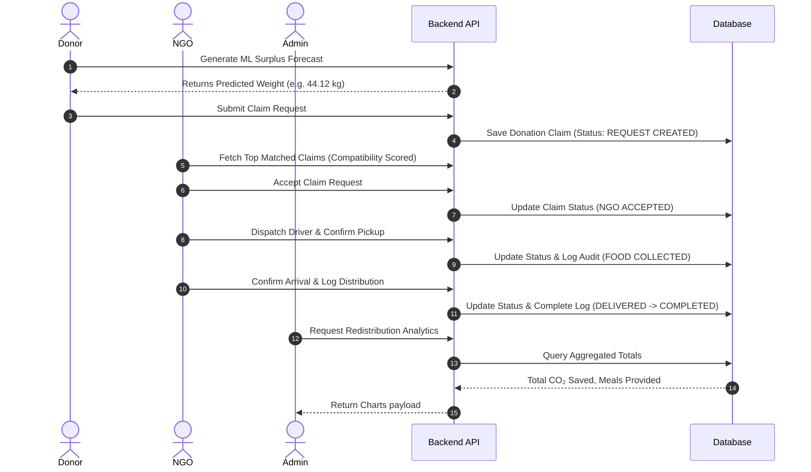

# ResqFood Link Platform - Project Design & Implementation Report

This comprehensive document serves as the official technical design, database architecture, and implementation report for the **ResqFood Link Platform**.

---

## 1. Front-End / GUI Design and Layout
The front-end is designed with premium web aesthetics, built using **React (Vite)** and **Tailwind CSS**.

### Key Visual & Layout Elements:
*   **Theme Control (Light / Dark Mode)**: A clean global dark theme switcher using tailwind variants and `localStorage` to prevent flicker.
*   **Dashboard Layout**: A persistent sidebar navigation with responsive collapsible grids showing ecological statistics, interactive tables, and charts.
*   **Interactive Maps**: Dynamic Leaflet maps powered by OpenStreetMap to draw and display active routing instructions for logistics.
*   **Data Visualization**: Custom dashboards built with Recharts (Bar, Line, and Pie charts) for visual auditing of carbon savings, meals portioned, and NGO leaderboards.
*   **Modern Cards**: Glassmorphic panels with blur backdrops (`backdrop-filter`) and smooth transitions to highlight active donations and routing diagnostics.

---

## 2. Back-End / Database Design
The back-end is constructed using **Python (FastAPI)**, applying a clean modular router layout, and powered by **SQLAlchemy** (supporting both SQLite for local execution and MySQL/PostgreSQL for production).

### Database Entity Relationship Model (ERD):

```mermaid
erDiagram
    USER {
        int id PK
        string email UNIQUE
        string password_hash
        string role "admin/donor/ngo"
        string name
        string phone
    }
    DONOR {
        int id PK
        int user_id FK
        string company_name
        string donor_type "supermarket/restaurant/hotel"
        string address
        float latitude
        float longitude
        string approval_status "approved/pending/declined"
    }
    NGO {
        int id PK
        int user_id FK
        string organization_name
        string registration_number
        string address
        float latitude
        float longitude
        string approval_status "approved/pending/declined"
    }
    DONATION_REQUEST {
        int id PK
        int donor_id FK
        string food_category
        string meal_type
        float quantity_kg
        datetime created_at
        datetime expiry_time
        string status "created/claimed/collected/delivered"
    }
    FULFILLMENT_LOG {
        int id PK
        int donation_request_id FK
        string status_from
        string status_to
        datetime logged_at
        string driver_name
        string driver_phone
        string remarks
    }

    USER ||--o| DONOR : "has profile"
    USER ||--o| NGO : "has profile"
    DONOR ||--o{ DONATION_REQUEST : "initiates"
    DONATION_REQUEST ||--o{ FULFILLMENT_LOG : "audits state"
```

---

## 3. Functionalities and Workflow
The platform workflow enforces sequential claims management across three major actor roles:



---

## 4. Front-End and Back-End Interaction
Communication is built on top of asynchronous REST API endpoints using **Axios**:
1.  **Authentication**: Users sign in via `/api/auth/login`. The server returns a JWT Token.
2.  **Stateful Interceptors**: The React frontend interceptor automatically catches the JWT token from `localStorage` and injects it into the `Authorization: Bearer <TOKEN>` header of every outgoing HTTP request.
3.  **Cross-Origin Resource Sharing (CORS)**: Configured dynamically on the FastAPI server to support multiple domains (Vite development, GitHub Pages, Vercel).

---

## 5. Unique Features & Differentiators
*   **Machine Learning Surplus Estimator**: Employs a linear regression pipeline. If ML files are missing, it falls back to a custom attendance ratio-based fallback algorithm to ensure zero app crashes.
*   **Weighted Compatibility Scorer**: A smart matching algorithm that ranks compatible NGOs for a donation request based on a multi-criteria compatibility matrix (30% Theme/Type, 25% Distance, 20% Capacity, 15% Size, 10% Urgency).
*   **Sequential Fulfillment Audit Logging**: Rejects out-of-order updates to state logs. Every transition triggers a permanent chronological database audit log capturing driver details and comments.

---

## 6. Pseudo Code

### Algorithm 1: ML Surplus Prediction Fallback Heuristic
```text
FUNCTION predict_surplus_fallback(prepared_qty, expected_people, actual_people, food_category):
    attendance_ratio = actual_people / expected_people
    
    // Heuristic base logic: if fewer people attended than expected
    IF attendance_ratio < 1.0 THEN
        surplus_percentage = (1.0 - attendance_ratio) * 0.85
    ELSE
        surplus_percentage = 0.05 // Baseline preparation error
    ENDIF

    // Modify baseline according to food category variables
    IF food_category IS "Cooked Meals" THEN
        surplus_percentage = surplus_percentage * 1.15
    ELSE IF food_category IS "Bakery" THEN
        surplus_percentage = surplus_percentage * 0.90
    ENDIF

    predicted_weight = prepared_qty * surplus_percentage
    RETURN min(predicted_weight, prepared_qty)
```

### Algorithm 2: NGO Compatibility Score Ranking
```text
FUNCTION calculate_ngo_compatibility(donation_request, ngo_profile):
    score = 0.0
    
    // 1. Distance compatibility (25% Weight)
    distance = calculate_distance(donation_request.lat, donation_request.lon, ngo_profile.lat, ngo_profile.lon)
    IF distance < 5 THEN score += 25.0
    ELSE IF distance < 15 THEN score += 15.0
    ELSE score += 5.0

    // 2. Quantity Fit / Capacity Match (35% Weight)
    capacity_diff = ngo_profile.daily_capacity - donation_request.quantity_kg
    IF capacity_diff >= 0 THEN score += 35.0
    ELSE IF capacity_diff > -20 THEN score += 20.0
    ELSE score += 5.0

    // 3. Focus Matching / Food Fit (40% Weight)
    IF donation_request.food_category IN ngo_profile.accepted_food_categories THEN
        score += 40.0
    ELSE
        score += 10.0
    ENDIF

    RETURN score
```

---

## 7. Implementation & Results

The system has been successfully verified, hosted, and deployed:

*   **Frontend GUI (GitHub Pages)**:
    👉 **[https://niranjans74.github.io/SURPLUS-FOOD-PREDICTION/](https://niranjans74.github.io/SURPLUS-FOOD-PREDICTION/)**
    *(Auto-deployed using GitHub Actions on merge to `gh-pages`)*

*   **Backend Server API (Render)**:
    👉 **`https://surplus-food-prediction.onrender.com`**
    *(FastAPI deployment with SQLite fallback database)*
