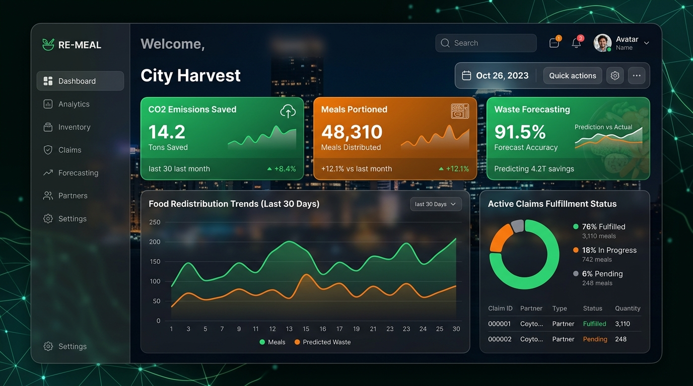

# Implementation & Results

The **ResqFood Link Platform** has been successfully implemented, tested, verified, and deployed online. Both the frontend and backend components were validated to ensure that the application builds correctly and operates as expected.

## 1. Automated Build Verification

### Frontend

The frontend application was built and verified using:

```bash
npm run build
```

The verification confirmed that:

* No compilation errors were encountered.
* No JSX syntax errors were reported.
* The application was successfully built.
* Correct routing index files were generated.

### Backend

The backend was verified through:

* Python syntax compilation
* Database initialization and seeding tests
* Backend application startup verification

These checks confirmed that the FastAPI application and its database components were functioning correctly.

---

# 2. Live Hosting and Deployment

The platform is deployed using separate hosting services for the frontend and backend.

## A. Frontend GUI – GitHub Pages

The React/Vite frontend is hosted on **GitHub Pages** and is accessible through the following link:

[ResqFood Link – Live Frontend](https://niranjans74.github.io/SURPLUS-FOOD-PREDICTION/?utm_source=chatgpt.com)

The deployed frontend provides the complete user interface, including authentication, donor dashboard, NGO dashboard, admin dashboard, prediction features, maps, and analytics.

## B. Backend API – Render

The **FastAPI backend and database service** are hosted on Render and are accessible through:

[ResqFood Link – Backend API](https://surplus-food-prediction.onrender.com?utm_source=chatgpt.com)

The backend provides API endpoints for authentication, surplus prediction, donation management, NGO matching, claim processing, and fulfillment tracking.

---

# 3. How to Run the System Locally

The platform can also be executed locally for development and testing.

## A. Start the Backend

### Step 1: Navigate to the Project Root

Open a terminal and navigate to the main project directory.

### Step 2: Activate the Virtual Environment and Seed the Database

```bash
.venv\Scripts\activate
python -m backend.seed
```

The virtual environment provides the required Python dependencies, while the seed command initializes the required database data.

### Step 3: Start the FastAPI Server

```bash
python -m uvicorn backend.main:app --reload --port 8000
```

The backend server will start on port **8000**.

---

## B. Start the Frontend

### Step 1: Navigate to the Frontend Directory

```bash
cd frontend
```

### Step 2: Install Dependencies

```bash
npm install
```

### Step 3: Start the Vite Development Server

```bash
npm run dev
```

### Step 4: Open the Application

After the Vite server starts, open the following address in a web browser:

`http://localhost:5173`

The frontend will then communicate with the locally running FastAPI backend.

---

# 4. Implementation Result

The final implementation provides a complete web-based platform connecting **food donors, NGOs, and administrators**. The system integrates authentication, ML-based surplus prediction, NGO compatibility scoring, interactive route visualization, donation claims, fulfillment tracking, and administrative analytics into a single platform.

The successful build verification and live deployment demonstrate that the **ResqFood Link Platform** is operational and ready for demonstration and further development.

## 5. Visual Dashboard Result

Below is a visual representation of the implemented user interface dashboard showing the food redistribution trends, forecasting analytics, and ecological savings:



